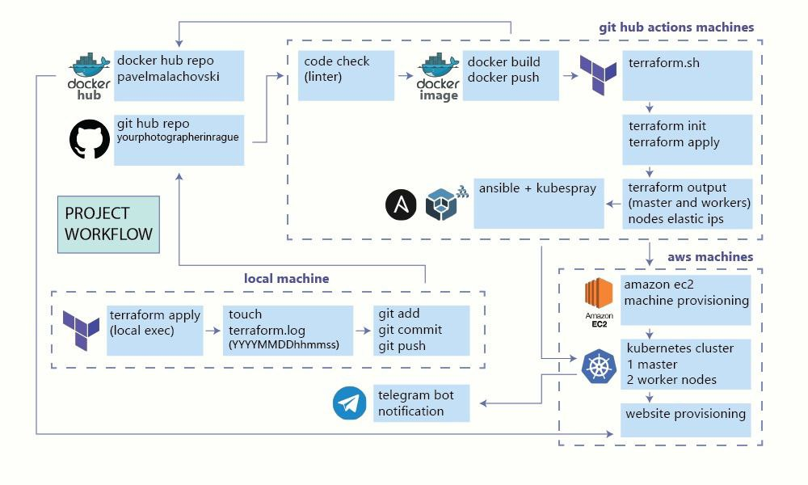

# Status of last Deployment

## Prerequisites
1. [Git](https://github.com/git-guides/install-git)
2. [Terraform](https://developer.hashicorp.com/terraform/tutorials/aws-get-started/install-cli)
3. AWS account
   1. AWS_ACCESS_KEY_ID
   2. AWS_SECRET_ACCESS_KEY

### Project workflow

### How to migrate wordpress website

### YourPhotographerInPrague
[YourPhotographerInPrague](https://www.alenatretyak.com)